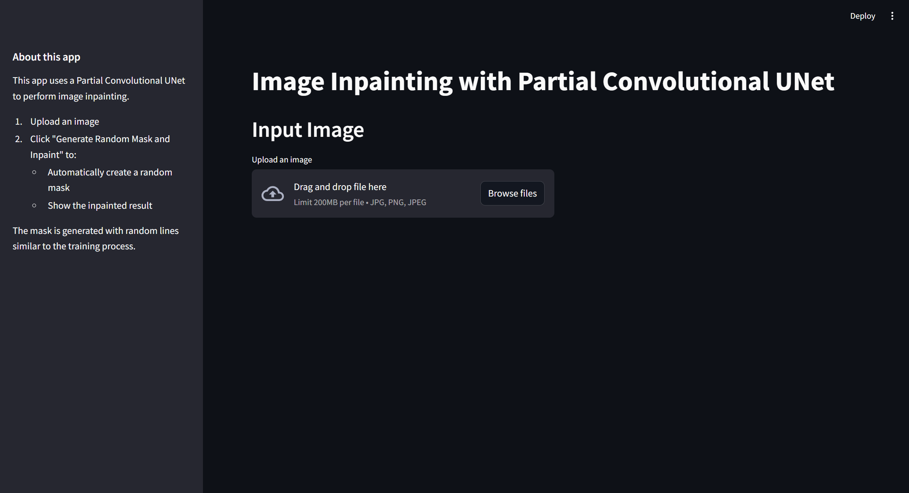
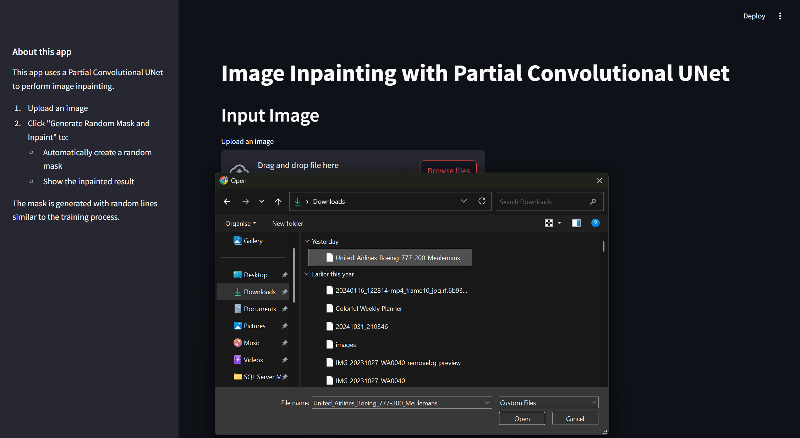
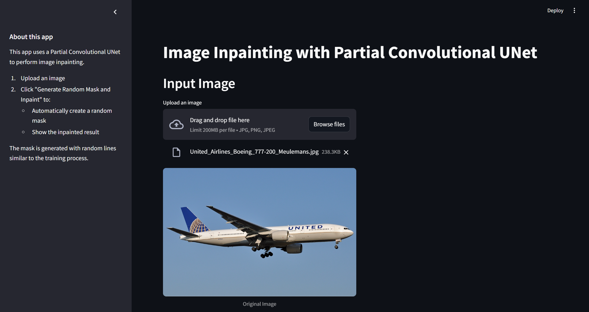
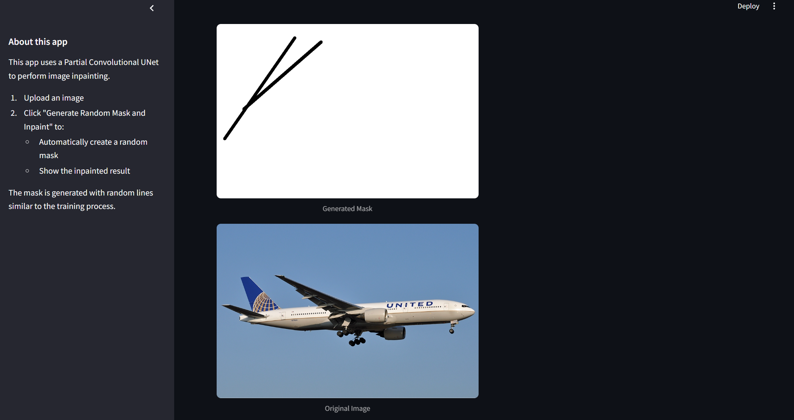
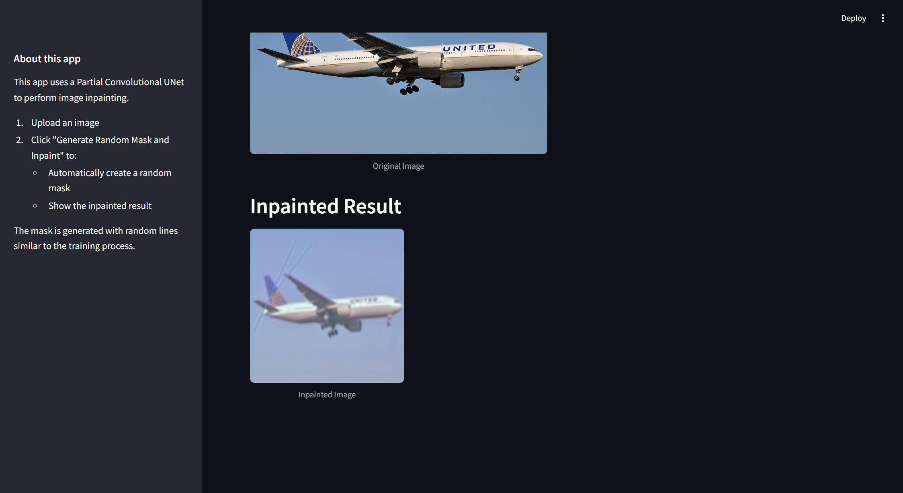

# 🎨 Deep Learning Image Inpainting with Partial Convolutions & U-Net

This project delivers a complete, end-to-end solution for image inpainting, featuring a powerful deep learning model with a user-friendly web interface. The application allows users to upload an image, which is then automatically masked with random occlusions. A sophisticated U-Net model with Partial Convolutions then intelligently fills in the missing regions, demonstrating the power of modern computer vision techniques.

The core of this project is the implementation of the paper:-

[Image Inpainting for Irregular Holes Using Partial Convolutions](https://arxiv.org/abs/1804.07723).

### Home Page


-----

## Demo

### Input Image


### Original Image


### Created Mask


### Output Image


-----

## ✨ Features

  * **Interactive Web Interface**: A clean and simple UI built with Streamlit for easy image uploading and processing.
  * **Automatic Mask Generation**: Random, free-form masks are generated on-the-fly to simulate real-world object removal scenarios.
  * **High-Fidelity Inpainting**: Utilizes a Partial Convolutional U-Net to produce sharp, coherent, and realistic reconstructions of missing image regions.
  * **Pre-trained Model**: Comes with a pre-trained model (`model.pth`) for immediate use, demonstrating the application's capabilities out-of-the-box.
  * **Complete Training & Evaluation Workflow**: Includes a Jupyter Notebook (`Image_Inpainting.ipynb`) that details the entire process of training the model from scratch and evaluating its performance.

-----

## 🔧 How It Works

The project is divided into three main components: the deep learning model, the training/evaluation notebook, and the web application.

### 1\. The Model: `model.py`

The brain of the operation is the **Partial Convolutional U-Net**. This architecture is specifically designed for inpainting tasks, especially those with irregular masks.

  * **Partial Convolution Layer (`PartialConvLayer`)**: Traditional convolutions treat all pixels (valid and masked) equally, often leading to artifacts like color discrepancies and blurriness in the output. A Partial Convolution, however, works differently:

    1.  The convolution is applied *only* to the valid, unmasked pixels within the kernel's window.
    2.  The output is then re-normalized by the proportion of valid pixels to counteract the shrinking valid area.
    3.  The mask itself is updated in a forward pass, with the newly inpainted region now considered "valid" for subsequent layers.

    This ensures that the model's predictions are only conditioned on valid data, resulting in significantly better performance.

  * **U-Net Architecture**: The model employs a U-Net, which is an encoder-decoder network with skip connections.

      * The **encoder** downsamples the image, capturing high-level contextual information about the scene.
      * The **decoder** upsamples the feature maps back to the original image size, reconstructing the image.
      * **Skip connections** link the encoder and decoder layers, allowing the decoder to access low-level feature information (like textures and edges) from the encoder. This is crucial for generating fine details in the inpainted result.

### 2\. The Training Notebook: `Image_Inpainting.ipynb`

This notebook provides a comprehensive guide to training the model. It covers:

  * **Data Preparation**: Loading and splitting the image dataset into training and testing sets.
  * **Data Augmentation**: Applying transformations and generating masks for the training images.
  * **Model Training**: The core training loop, which feeds masked images to the model and updates its weights based on a loss function comparing the output to the original image.
  * **Evaluation**: Calculating key performance metrics to assess the model's accuracy:
      * **MSE (Mean Squared Error)**: Measures the average squared difference between pixels.
      * **PSNR (Peak Signal-to-Noise Ratio)**: Measures the ratio between the maximum possible power of a signal and the power of corrupting noise. Higher is better.
      * **SSIM (Structural Similarity Index)**: Measures image quality based on perceived changes in structural information, luminance, and contrast. Closer to 1 is better.

### 3\. The Web Application: `app.py`

This script creates the user-facing application using Streamlit.

1.  **Load Model**: The pre-trained `PartialConvUNet` model is loaded into memory.
2.  **Image Upload**: The user uploads an image file through the web interface.
3.  **Mask Generation**: A random mask consisting of several lines of varying thickness is created.
4.  **Preprocessing**: The uploaded image and the generated mask are converted to PyTorch tensors and normalized.
5.  **Inference**: The model performs a forward pass on the masked image and mask tensors to generate the inpainted output.
6.  **Post-processing**: The output tensor is converted back into an image format that can be displayed on the web page.
7.  **Display Results**: The original image, the generated mask, and the final inpainted image are all displayed for comparison.

-----

## 🚀 Getting Started

Follow these steps to run the web application on your local machine.

### Prerequisites

  * Python 3.8+
  * Pip package manager

### 1\. Clone the Repository

Clone this project to your local machine:

```bash
git clone <repository-url>
cd <project-directory>
```

### 2\. Create and Activate a Virtual Environment (Recommended)

```bash
# For Linux/macOS
python3 -m venv venv
source venv/bin/activate

# For Windows
python -m venv venv
.\venv\Scripts\activate
```

### 3\. Install Dependencies

Create a file named `requirements.txt` with the following content:

```txt
streamlit
torch
torchvision
numpy
Pillow
opencv-python-headless
```

Then, install the required packages using pip:

```bash
pip install -r requirements.txt
```

**Note**: This project uses a CPU-compatible version of PyTorch (`torch`). If you have a CUDA-enabled GPU, you can install a GPU-compatible version for faster performance by following the instructions on the [official PyTorch website](https://pytorch.org/).

### 4\. Run the Streamlit App

Launch the application by running:

```bash
streamlit run app.py
```

Your web browser should automatically open to the application's URL (usually `http://localhost:8501`).

-----

## 📖 Usage

1.  **Open the application** in your web browser.
2.  **Click "Browse files"** to upload an image from your computer (PNG, JPG, and JPEG are supported).
3.  The original image will be displayed.
4.  **Click the "Generate Random Mask and Inpaint" button.**
5.  Wait for a few moments while the model processes the image.
6.  The application will display the randomly generated mask and the final, inpainted image.

-----
